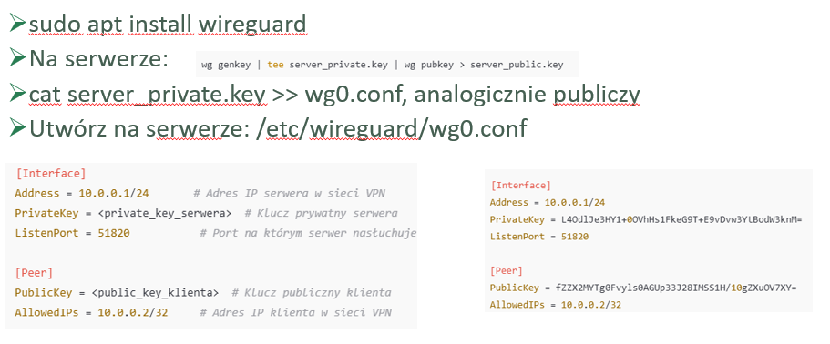
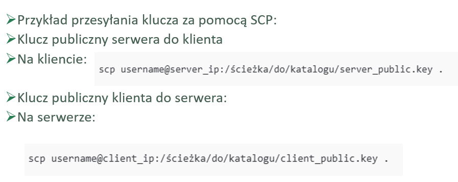
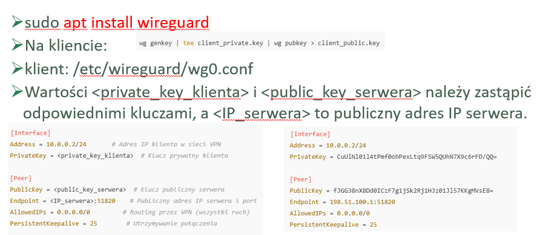
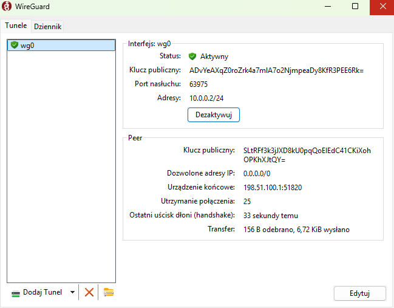
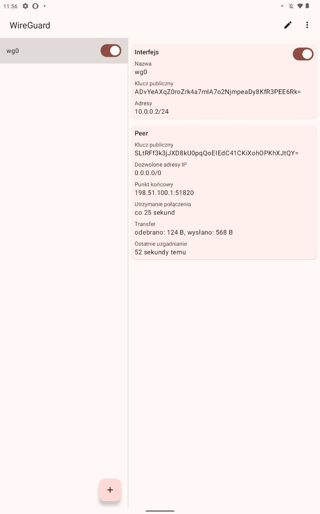
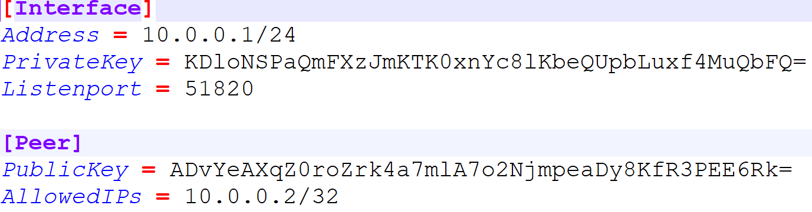
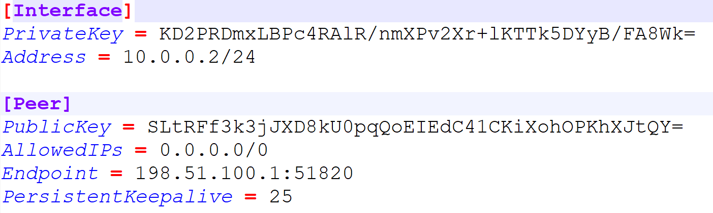

# Ćwiczenia 61 -- instalacja i konfiguracja VPN - wireguard

1. Zaloguj się na swoje konto w ubuntu server.

1. Ustaw kartę serwera eno1 na ip: 198.51.100.1/24 w netplanie.

1. Instalacja WireGuard na serwerze:

   

   Instalacja:

   ```bash
   sudo apt install wireguard -y 
   ```

   Generowanie kluczy:

   ```bash
   wg genkey | tee server_private.key | wg pubkey > server_public.key 
   ```

   server_private.key – zachowaj dla siebie

   server_public.key – będzie potrzebny do konfiguracji drugiego urządzenia.

   Dodanie kluczy do pliku wg0.conf:

   ```bash
   cat server_private.key >> wg0.conf
   cat server_ppublic.key >> wg0.conf 
   ```

   Plik wg0.conf:

   ```conf
   [Interface]

   Address = 10.0.0.1/24
   ListenPort = 51820
   PrivateKey = <KLUCZ_PRYWATNY_SERWERA>

   [Peer]

   # Klucz publiczny stacji Desktop

   PublicKey = <KLUCZ_PUBLICZNY_DESKTOP>
   AllowedIPs = 10.0.0.2/32

   ```

1. Uruchomienie wireguard i sprawdzenie stanu:

   

   Uruchomienie:

   ```bash
   sudo wg-quick up wg0
   ```

   Zatrzymanie:

   ```bash
   sudo wg-quick down wg0
   ```

   Sprawdzenie statusu:

   ```bash
   sudo wg show
   ```

1. Przesłanie kluczy publicznych:

   

   Na kliencie:

   ```bash
   scp user@serwer_ip:/ścieżka/server_public.key .
   ```

   Na serwerze:

   ```bash
   scp user@ip_klienta:/ścieżka/client_public.key .
   ```

1. Instalacja WireGuard na kliencie ubuntu desktop:

   Instalacja:

   ```bash
   sudo apt install wireguard -y 
   ```

   Generowanie kluczy:

   ```bash
   wg genkey | tee client_private.key | wg pubkey > client_public.key 
   ```

   

   Plik wg0.conf:

   ```conf
   [Interface]
    Address = 10.0.0.2/24
    PrivateKey = <KLUCZ_PRYWATNY_DESKTOP>

    [Peer]

    # Klucz publiczny serwera

    PublicKey = <KLUCZ_PUBLICZNY_SERWERA>
    Endpoint = <PUBLICZNY_ADRES_IP_SERWERA>:51820
    AllowedIPs = 10.0.0.0/24

    # Opcjonalne: utrzymywanie połączenia przez NAT

    PersistentKeepalive = 25

   ```

1. Testowanie łączności (ping)
   Jeśli `wg show` pokazuje udany "handshake", spróbuj spingować drugą stronę tunelu:

   Z serwera do desktopa:

   ```bash
   ping 10.0.0.2
   ```

   Z desktopa do serwera:

   ```bash
   ping 10.0.0.1
   ```

1. Instalacja WireGuard na kliencie windows:

   

1. Instalacja WireGuard na kliencie android (tablet):

   

1. Przykład dla serwera:

   

1. Przykład dla klienta:

  

1. KONIEC.🔚
