Ćwiczenia 6 -- Ubuntu serwer -- tworzenie i modyfikacja konta
Zaloguj się na swoje konto imienXYZ, gdzie XYZ oznacza kod klasy i
grupy, np. jank3t1
Jeśli nie masz konta, sudo adduser imienXYZ
1.  Dodaj swoje konto do grupy sudo: *sudo usermod twoje_konto -G sudo*
2.  Sprawdzenie czy jesteśmy w grupie sudo: *id konto*
3.  Utwórz katalog \~/konta i przejdź do niego.
4.  Sprawdź ustawienia w pliku /etc/default/useradd poprzez cat lub
    useradd -D.
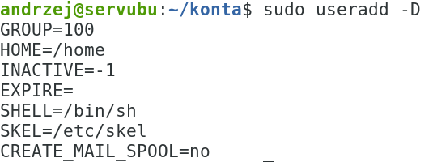
5.  Sprawdź ustawienia w pliku /etc/default/useradd
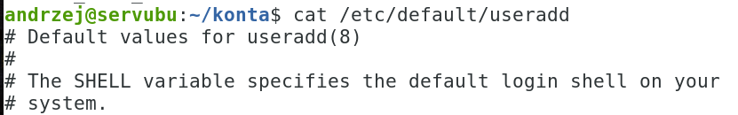
6.  Sprawdzić zawartość katalogu skel
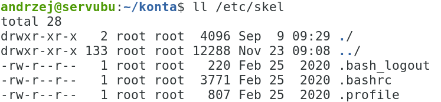
7.  Zmienna GROUP=100 w pliku /etc/default/useradd oznacza, iż nowo
    zakładane konto
zostanie przypisane do grupy users, o ile zostanie założone z parametrem
-N, np.:
useradd -N michal
a)  Analogicznie zmienna
b)  HOME służy do określenia lokalizacji katalogów domowych,
c)  SHELL do ustawienia powłoki użytkownika,
d)  SKEL określa katalog, którego zawartość zostanie skopiowana do
    profilu użytkownika (zazwyczaj są to pliki: .bashrc, .bash_logout i
    .bash_profile ),
e)  INACTIVE=-1 to odpowiednik -f dla useradd, a
f)  EXPIRE jeśli jest puste oznacza, że konto nigdy nie wygasa (uwaga!!!
    format daty, jeśli ustawiamy to MM/DD/RR).
<!-- -->
8.  Utwórz kopię pliku /etc/default/useradd i katalogu /etc/skel/ z
    zawartością
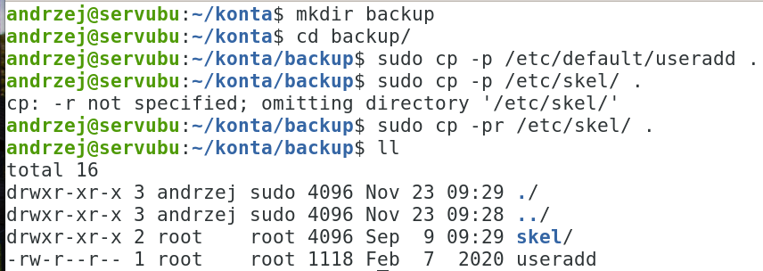
9.  Sprawdzenie, że nowo tworzone konto nie jest funkcjonalne
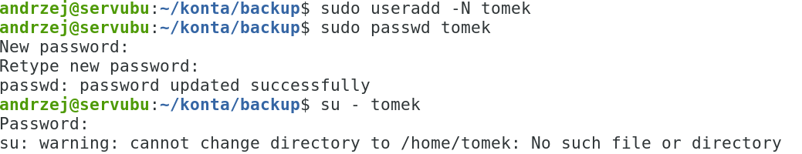
10. Usuń konto tomek.
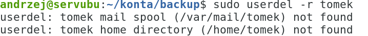
11. Zmodyfikuj zawartość plik /etc/default/useradd
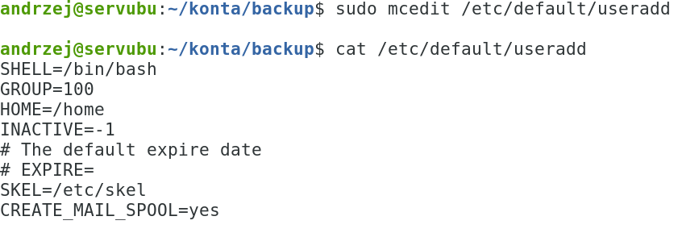
12. Dodaj plik powitalny dla nowo tworzonego konta o nazwie readme
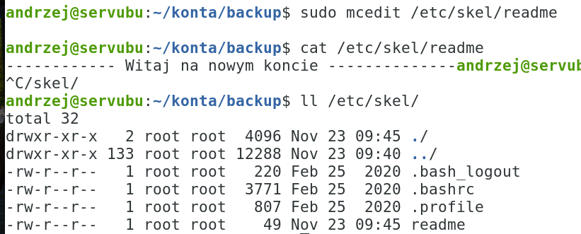
13. Sprawdź wprowadzone zmiany do systemu:
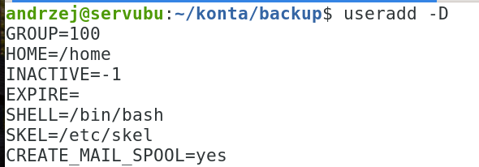
14. Utwórz konto z parametrem N.
15. Utwórz dla niego hasło.
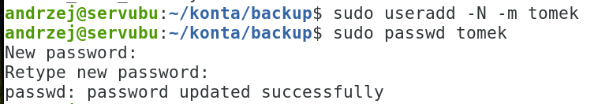
16. Zaloguj się na to konto w drugim terminalu, sprawdź ustawienia i
    pliki:
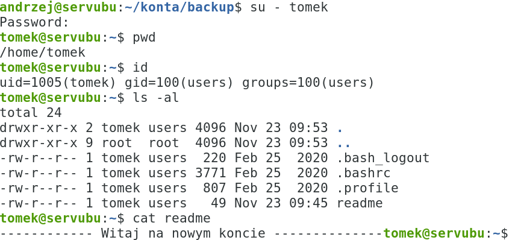
17. Zaloguj się na utworzone konto z komputera sąsiada z pomocą ssh.
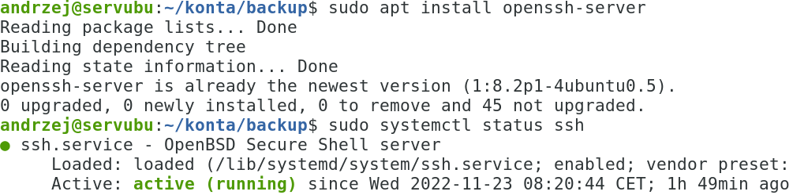
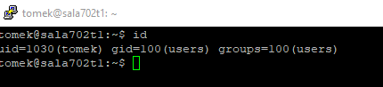
18. Sprawdzić ustawienia dla konta tomek, wygasanie hasła, itd.
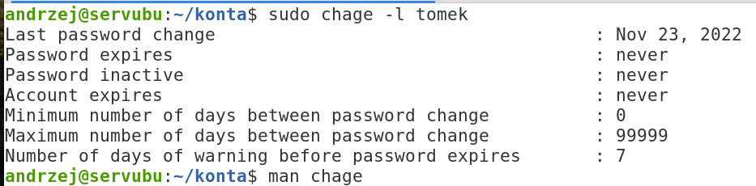
19. Sprawdzić ustawienia z pomocą komendy passwd
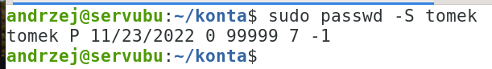
20. Przywrócić plik /etc/default/useradd z kopii.
21. *sudo poweroff* ( na koniec zajęć)
