# Ćwiczenia 6 -- Ubuntu serwer -- tworzenie i modyfikacja konta

💡Zaloguj się na swoje konto imienXYZ, gdzie XYZ oznacza kod klasy i
grupy, np. jank3t1
Jeśli nie masz konta, sudo adduser imienXYZ

1. Dodaj swoje konto do grupy sudo:

   ```bash
   sudo usermod twoje_konto -G sudo
   ```

1. Sprawdzenie czy jesteśmy w grupie sudo:

   ```bash
   id konto
   ```

1. Utwórz katalog \~/konta i przejdź do niego.

1. Sprawdź ustawienia w pliku /etc/default/useradd poprzez cat lub
    useradd -D.

   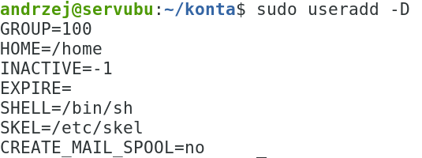

1. Sprawdź ustawienia w pliku /etc/default/useradd

   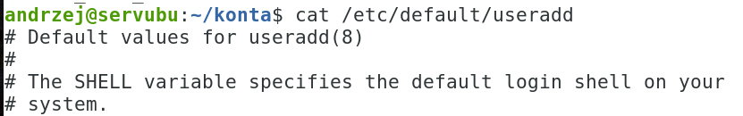

1. Sprawdzić zawartość katalogu skel

   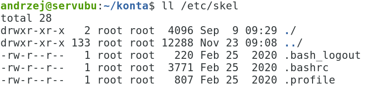

1. Zmienna GROUP=100 w pliku /etc/default/useradd oznacza, iż nowo
   zakładane konto zostanie przypisane do grupy users, o ile zostanie
   założone z parametrem -N, np.:

   ```bash
   useradd -N michal
   ```

    - Analogicznie zmienna
    - HOME służy do określenia lokalizacji katalogów domowych,
    - SHELL do ustawienia powłoki użytkownika,
    - SKEL określa katalog, którego zawartość zostanie skopiowana do
    profilu użytkownika (zazwyczaj są to pliki: .bashrc, .bash_logout i
    .bash_profile ),
    - INACTIVE=-1 to odpowiednik -f dla useradd, a
    - EXPIRE jeśli jest puste oznacza, że konto nigdy nie wygasa (uwaga!!!
    format daty, jeśli ustawiamy to MM/DD/RR).

1. Utwórz kopię pliku /etc/default/useradd i katalogu /etc/skel/ z
    zawartością

   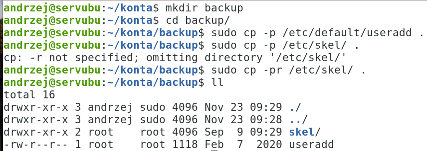

1. Sprawdzenie, że nowo tworzone konto nie jest funkcjonalne

   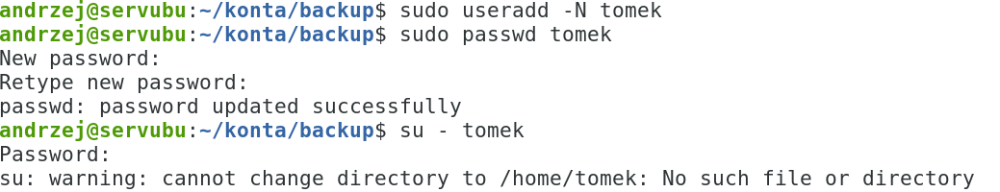

1. Usuń konto tomek.

   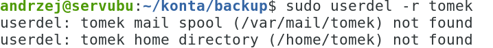

1. Zmodyfikuj zawartość plik /etc/default/useradd

   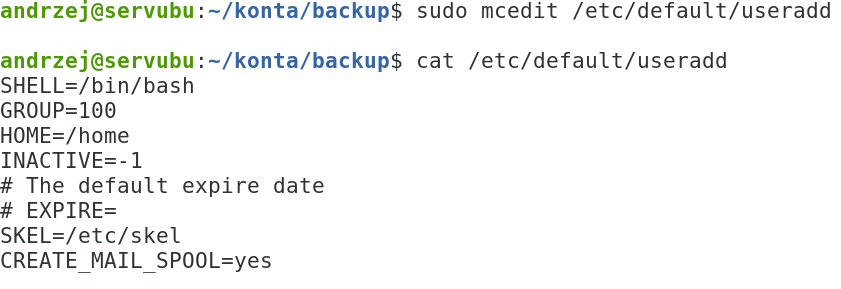

1. Dodaj plik powitalny dla nowo tworzonego konta o nazwie readme

   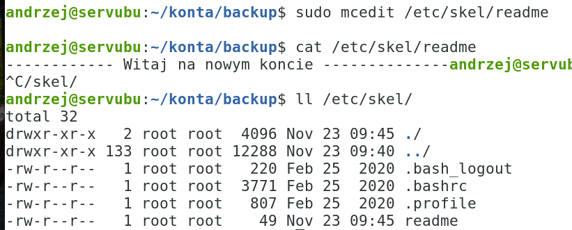

1. Sprawdź wprowadzone zmiany do systemu:

   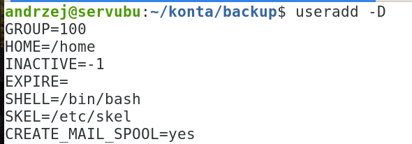

1. Utwórz konto z parametrem N.

1. Utwórz dla niego hasło.

   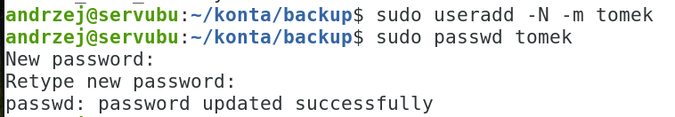

1. Zaloguj się na to konto w drugim terminalu, sprawdź ustawienia i
    pliki:

   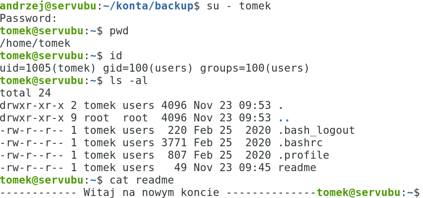

1. Zaloguj się na utworzone konto z komputera sąsiada z pomocą ssh.

   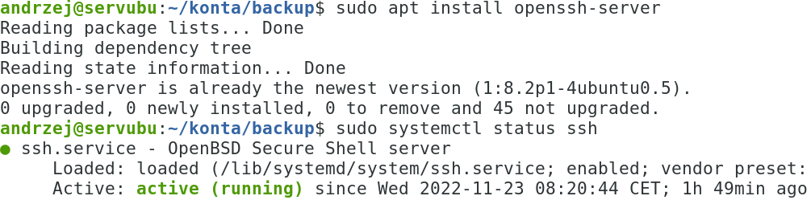

   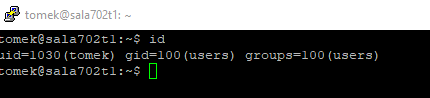

1. Sprawdzić ustawienia dla konta tomek, wygasanie hasła, itd.

   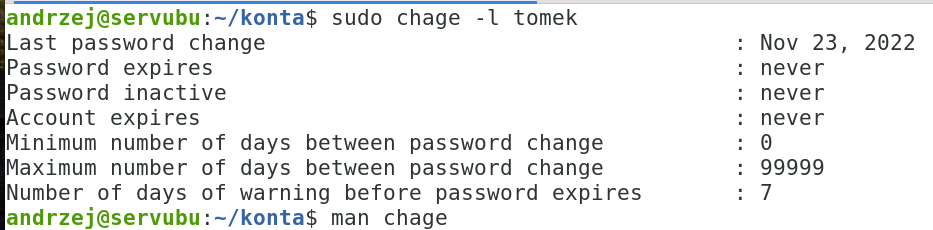

1. Sprawdzić ustawienia z pomocą komendy passwd

   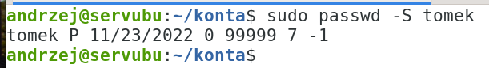

1. Przywrócić plik /etc/default/useradd z kopii.

1. Na koniec zajęć:

   ```bash
   sudo poweroff
   ```
