Ćwiczenia 7 -- Ubuntu serwer -- archiwizacja, kompresja
Zaloguj się na swoje konto imienXYZ, gdzie XYZ oznacza kod klasy i
grupy, np. jank3t1
Jeśli nie masz konta, sudo adduser imienXYZ
1.  Dodaj swoje konto do grupy sudo: *sudo usermod twoje_konto -G sudo*
2.  Sprawdzenie czy jesteśmy w grupie sudo: *id konto*
3.  Zainstaluj 7-zip:

4.  
    Przygotować strukturę katalogów:
5.  Utwórz 4 pliki z pomocą komend:
> 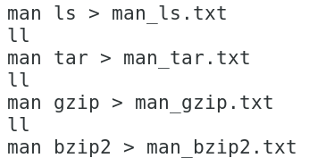
6.  Utwórz archiwum w katalogu man powyższych plików:
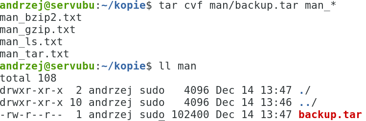
7.  Utworzyć archiwum katalogu /usr/share/doc
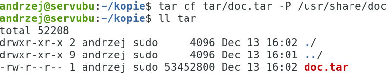
8.  Sprawdź poprawność spakowania w programie mc. ( wejście w plik
    archiwum )
9.  Wypakuj archiwum doc.tar do katalogu \~/kopie/tar/
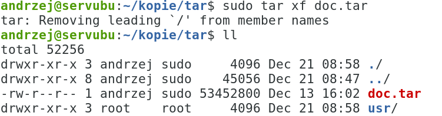
10. Spakuj katalog /usr/share/doc z użyciem tar, gzip, bzip2, xz i 7z
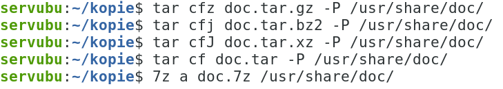
11. Porównaj wielkości poszczególnych plików archiwum (wartość w
    bajtach). Który jest najmniejszy?
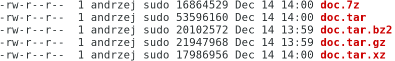
12. Wypakuj powyższe pliki do odpowiednich katalogów, np.:

13. Pozostałe:
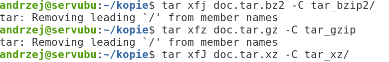
14. Wypakowanie archiwum 7z:

15. Spakuj plik doc.tar narzędziem gzip używając 5 stopnia kompresji.
Spakuj plik doc.tar narzędziem gzip używając 1 i 9 stopnia kompresji.
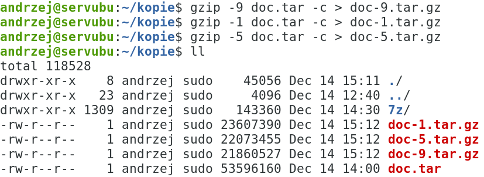
16. Wykonaj archiwum z pominięciem pliku:

17. Wykonaj archiwum tar.bz2 zachowując uprawnienia

18. Utwórz archiwum z pomocą gzipa plików man\*
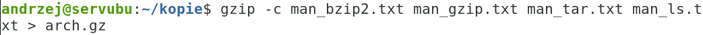
19. Utwórz archiwum z pomocą gzipa plików man\* zastosuj najlepszy
    stopień kompresji
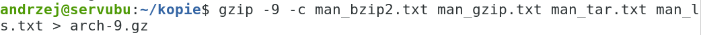
20. Utwórz archiwum z pomocą gzipa plików man\* zastosuj najgorszy
    stopień kompresji
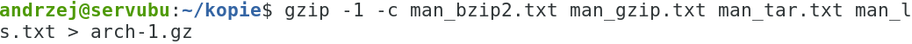
21. Porównaj rozmiary powstałych plików
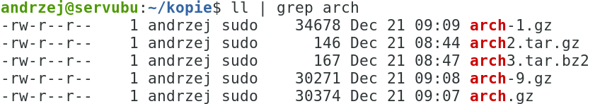
22. Rozpakuj wybrane dwa pliki \*.gz w katalogu gzip i gzip2
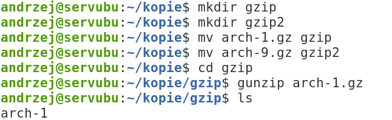
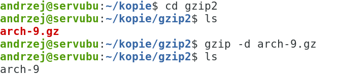
23. Utwórz archiwum z pomocą bzipa plików man\*

24. Sprawdź zawartość utworzonego archiwum

25. Utwórz archiwum z pomocą bzipa plików man\* zastosuj najlepszy
    stopień kompresji

26. Utwórz archiwum z pomocą bzipa plików man\* zastosuj najgorszy
    stopień kompresji

27. Porównaj rozmiary powstałych plików
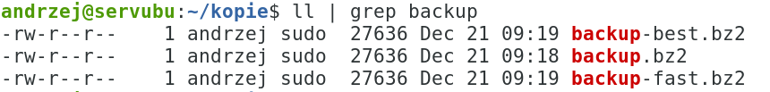
28. Rozpakuj wybrane dwa pliki \*.bz2 w katalogu bzip i bzip2
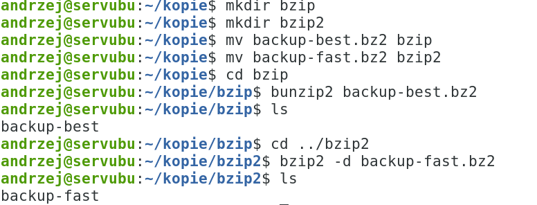
29. Sprawdź poprawność rozpakowania.
30. Dodatkowe zadania:
<!-- -->
a)  
    Wyodrębnij tylko pliki z rozszerzeniem
    conf
b)  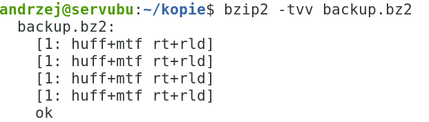
    Sprawdź spójność archiwum bzip2, gzip,
    tar, 7z
c)  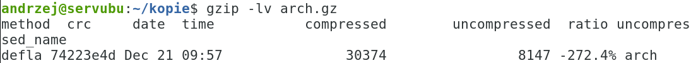
    Wypisz informacje na temat
    skompresowanego pliku archiwum bzip2, gzip, tar, 7z
d)  Porównaj czas wykonania archiwum tar, gzip i bzip2
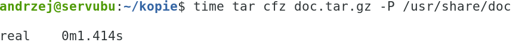
31. *sudo 31. shutdown now* ( na koniec zajęć)
