# Ćwiczenia 7 -- Ubuntu serwer -- archiwizacja, kompresja

💡 Zaloguj się na swoje konto imienXYZ, gdzie XYZ oznacza kod klasy i
grupy, np. jank3t1
Jeśli nie masz konta,

```bash
sudo adduser imienXYZ
```

1. Dodaj swoje konto do grupy sudo:

   ```bash
   sudo usermod twoje_konto -G sudo
   ```

1. Sprawdzenie czy jesteśmy w grupie sudo:

   ```bash
   id konto
   ```

1. Zainstaluj 7-zip:

   ```bash
    sudo apt install p7zip-full
   ```

   

1. Przygotować strukturę katalogów:

   

1. Utwórz 4 pliki z pomocą komend:

    ```bash
    man ls > man_ls.txt
    man tar > man_tar.txt
    man gzip > man_gzip.txt
    man bzip2 > man_bzip2.txt
    
    ```

   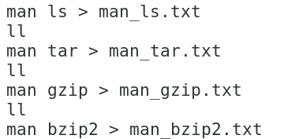

1. Utwórz archiwum w katalogu man powyższych plików:

   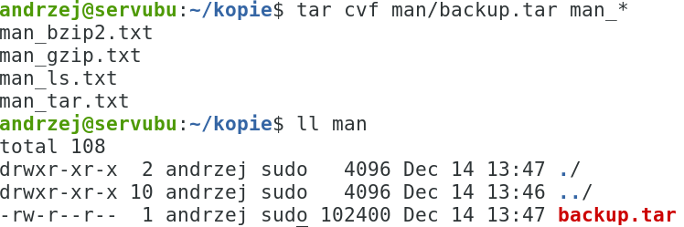

1. Utworzyć archiwum katalogu _/usr/share/doc_

   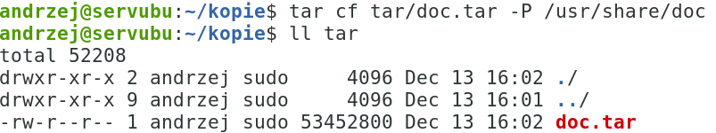

1. Sprawdź poprawność spakowania w programie mc. ( wejście w plik
    archiwum )

1. Wypakuj archiwum doc.tar do katalogu _~/kopie/tar/_

   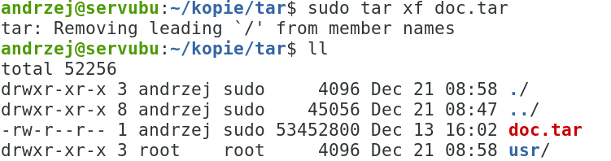

1. Spakuj katalog _/usr/share/doc_ z użyciem `tar`, `gzip`, `bzip2`, `xz` i `7z`

   ```bash
   tar cfz doc.tar.gz -P /usr/share/doc/
   ```

   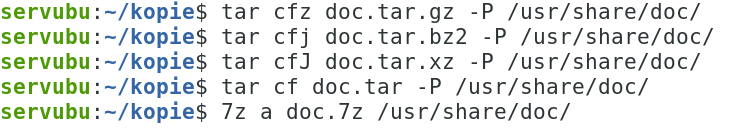

1. Porównaj wielkości poszczególnych plików archiwum (wartość w
    bajtach). Który jest najmniejszy?

   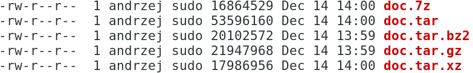

1. Wypakuj powyższe pliki do odpowiednich katalogów, np.:

   

1. Pozostałe:

   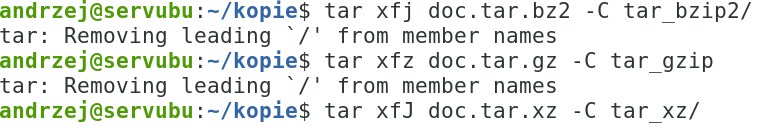

1. Wypakowanie archiwum 7z:

   

1. Spakuj plik doc.tar narzędziem gzip używając 5 stopnia kompresji.
   Spakuj plik doc.tar narzędziem gzip używając 1 i 9 stopnia kompresji.

   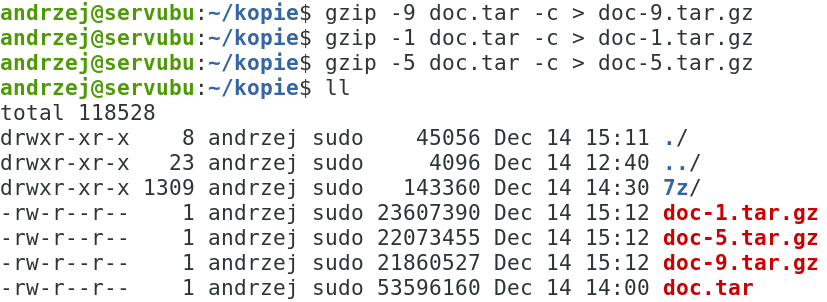

1. Wykonaj archiwum z pominięciem pliku:

   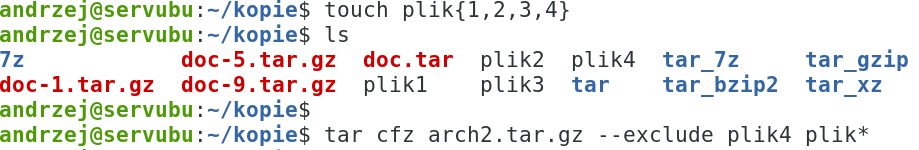

1. Wykonaj archiwum tar.bz2 zachowując uprawnienia

   

1. Utwórz archiwum z pomocą gzipa plików man

   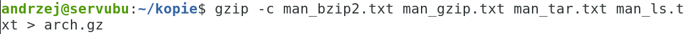

1. Utwórz archiwum z pomocą gzipa plików man\* zastosuj najlepszy
    stopień kompresji

   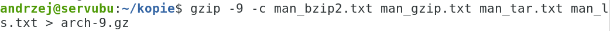

1. Utwórz archiwum z pomocą gzipa plików man\* zastosuj najgorszy
    stopień kompresji

   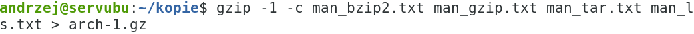

1. Porównaj rozmiary powstałych plików

   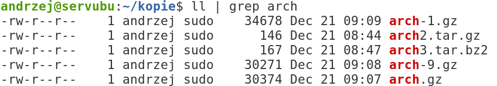

1. Rozpakuj wybrane dwa pliki \*.gz w katalogu gzip i gzip2

   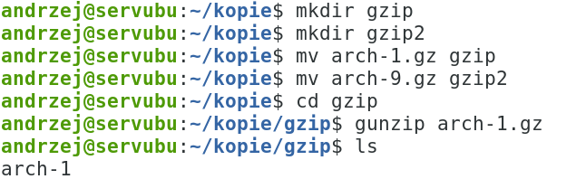

   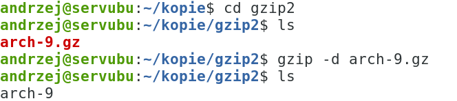

1. Utwórz archiwum z pomocą bzipa plików man\*

   

1. Sprawdź zawartość utworzonego archiwum

   

1. Utwórz archiwum z pomocą bzipa plików man\* zastosuj najlepszy
    stopień kompresji

   

1. Utwórz archiwum z pomocą bzipa plików man\* zastosuj najgorszy
    stopień kompresji

   

1. Porównaj rozmiary powstałych plików

   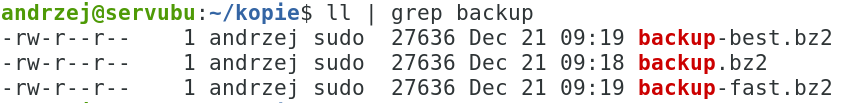

1. Rozpakuj wybrane dwa pliki \*.bz2 w katalogu bzip i bzip2

   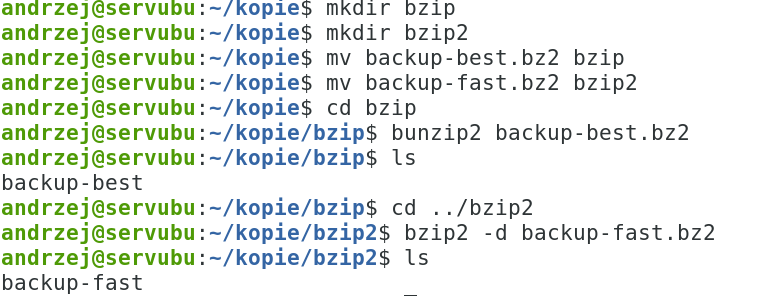

1. Sprawdź poprawność rozpakowania.

1. Dodatkowe zadania:

   - wyodrębnij tylko pliki z rozszerzeniem conf

     

   - sprawdź spójność archiwum bzip2, gzip, tar, 7z

     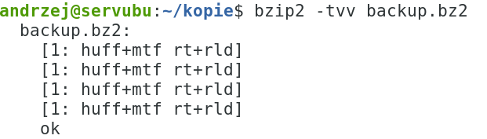

   - wypisz informacje na temat skompresowanego pliku archiwum bzip2, gzip, tar, 7z

     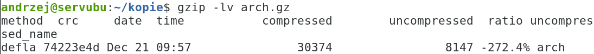

   - porównaj czas wykonania archiwum tar, gzip i bzip2

     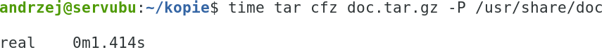

1. Na koniec zajęć:

```bash
 sudo shutdown now 
```
