Ćwiczenia 8 -- instalacja i konfiguracja serwera FTP ze źródeł
1.  Zaloguj się na swoje konto.
2.  Sprawdź czy zainstalowany jest pakiet vsftpd
3.  Utwórz katalog /home/twoje_konto**/**vsftpd**/**, a w nim podkatalog
    download
4.  Źródła pobrać narzędziem wget ze strony
    <https://security.appspot.com/downloads/vsftpd-3.0.5.tar.gz>
5.  Sumę kontrolną pobrać narzędziem curl -O ze strony
    <https://security.appspot.com/downloads/vsftpd-3.0.5.tar.gz.asc>
6.  
    Pobierz klucz GPG key (67A2 AB4F 41F9
    972C 21F6 BF66 7B89 011B CAE1 CFEA):
7.  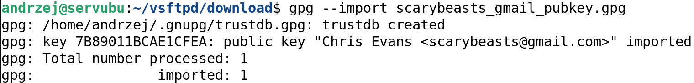
    Zaimportuj klucz:
8.  Sprawdzić poprawność importu klucza komendą:
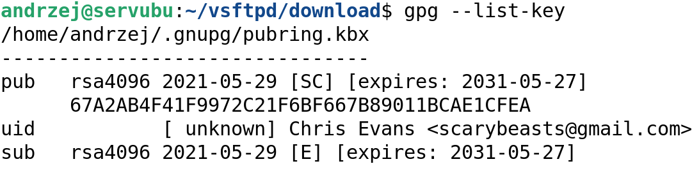
9.  Sprawdź klucz komendą gpg --verify:
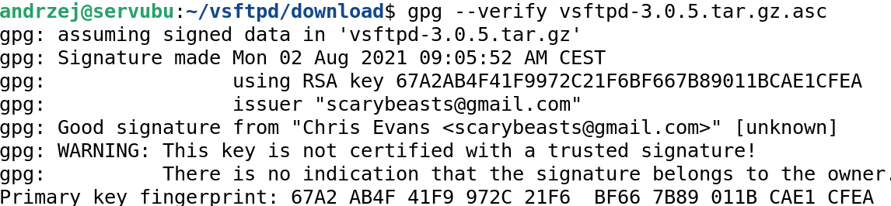
10. Sprawdzamy na stronie
    <https://security.appspot.com/vsftpd.html#download>
> odcisk palca.
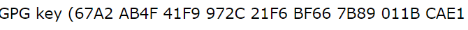
11. Rozpakować plik **vsftpd-3.0.5.tar.gz** komendą tar.
> 
12. Następnie przejść do katalogu vsftpd-3.0.5
13. Przeczytaj zawartość pliku INSTALL.
14. Wydać komendę: **make**
15. Jeśli make zakończy się bez błędów, wydać komendę:
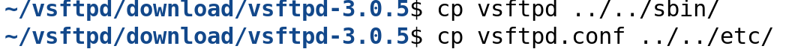
16. Przejdź do katalogu /home/twoje_konto/vsftpd i załóż katalogi sbin,
    etc i log.
17. Ustaw uprawnienia:
> 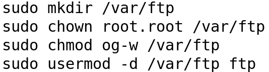
18. 
    Sprawdź czy istnieje konto ftp ( można
    sudo apt install vsftpd)
19. 
    Ustaw prawa:
20. 
    Uruchom serwer komendą:
21. Zaloguj się na serwerze i załóż katalog /usr/share/empty
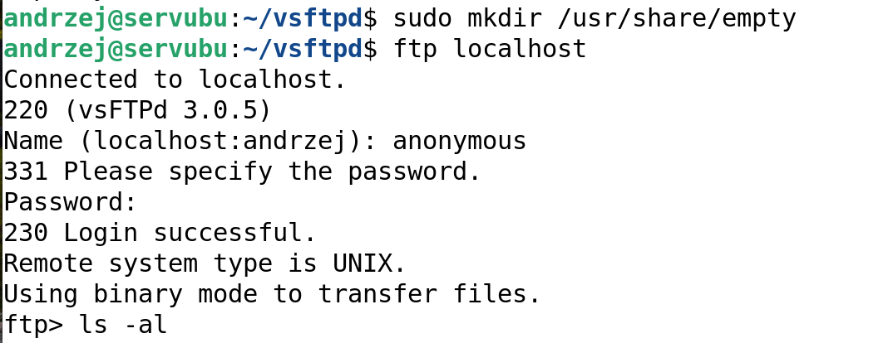
22. Sprawdź czy istnieje proces dla serwera komendą: ps aux \| grep
    vsftpd
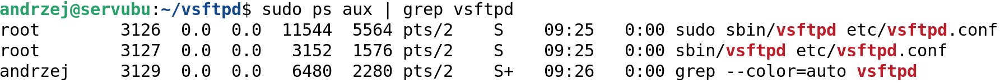
23. Utwórz plik:

24. Ściągnij plik
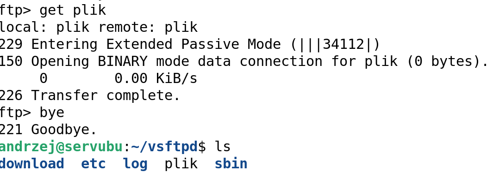
25. Sprawdź działanie serwera ftp, wyślij na serwer plik:
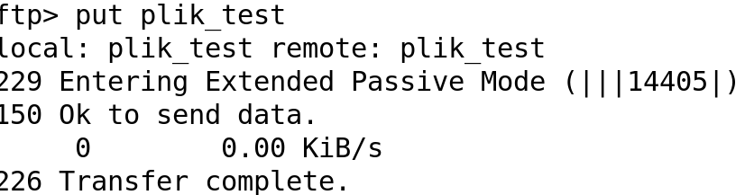
26. 
    Sprawdź log, tail -f
    /var/log/vsftpd.log:
27. 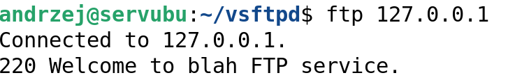
    Ustaw banner ftp dla serwera na min.
    30 znaków:
28. 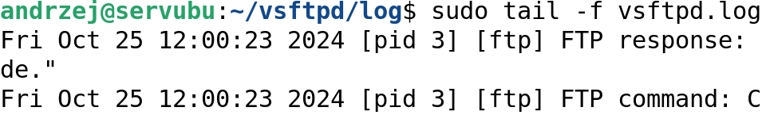
    Sprawdź logi:
29. 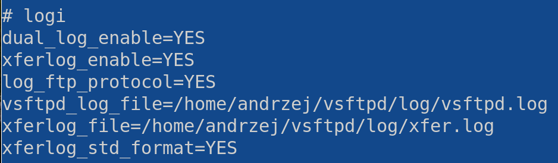
    Przestaw logi na swoją lokalizację
    \~/vsftpd/log, utwórz dual log w oparciu o notatki z wykładu:
30. 
    Sprawdź aktywne połączenia ze swoim
    serwerem komendą: netstat lub ss -anp \| grep 21
31. Zezwól na logowanie się użytkowników systemowych, następnie wykonaj
    powyższe zadania dla swojego konta.
32. Stwórz konfigurację serwera dla obsługi SSL ( następna strona ).
33. Utwórz katalog \~/vsftpd_ssl/download
34. Skopiuj do niego plik vsftpd-3.0.5.tar.gz
35. 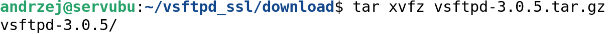
    Rozpakuj plik jak wcześniej:
36. Edycja pliku:
> 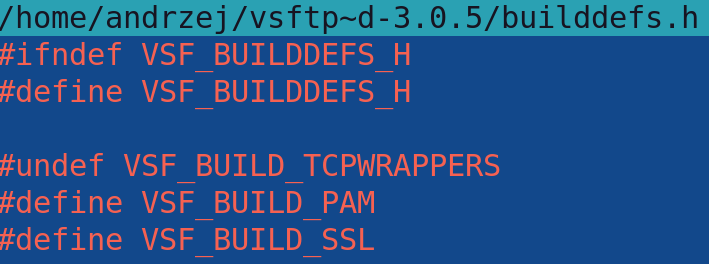
37. 
    Zmodyfikuj plik Makefile tak, aby
    (dopisz Wno):
> 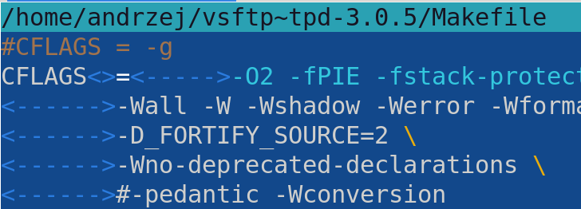
38. Wydaj komendę make.
39. 
    Jeśli wystąpią błędy to zainstaluj
    pakiet libssl-dev.
40. Wydaj komendę make.
41. Wygeneruj certyfikat tak jak dla apache ( sudo openssl ....).
42. Reszta jak na wykładzie.
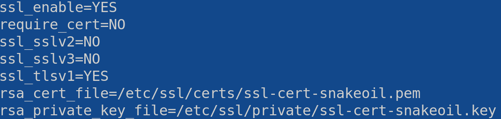
43. Przetestuj działanie serwera po ssl.
> 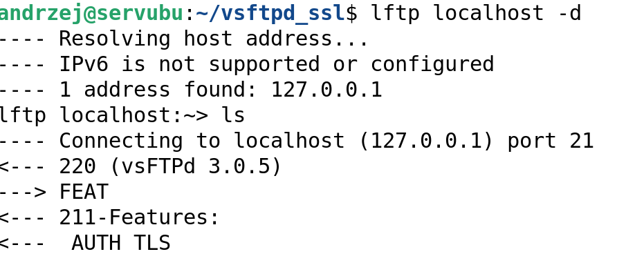
44. KONIEC
