# Ćwiczenia 8 -- instalacja i konfiguracja serwera FTP ze źródeł

1. Zaloguj się na swoje konto.

1. Sprawdź czy zainstalowany jest pakiet vsftpd

1. Utwórz katalog /home/twoje_konto**/**vsftpd**/**, a w nim podkatalog
    download

1. Źródła pobrać narzędziem wget ze strony

   <https://security.appspot.com/downloads/vsftpd-3.0.5.tar.gz>

1. Sumę kontrolną pobrać narzędziem curl -O ze strony

   <https://security.appspot.com/downloads/vsftpd-3.0.5.tar.gz.asc>

   

1. Pobierz klucz GPG key (67A2 AB4F 41F9
    972C 21F6 BF66 7B89 011B CAE1 CFEA):

   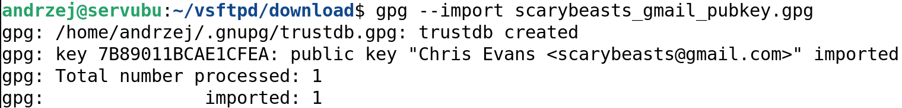

    Zaimportuj klucz:

1. Sprawdzić poprawność importu klucza komendą:

   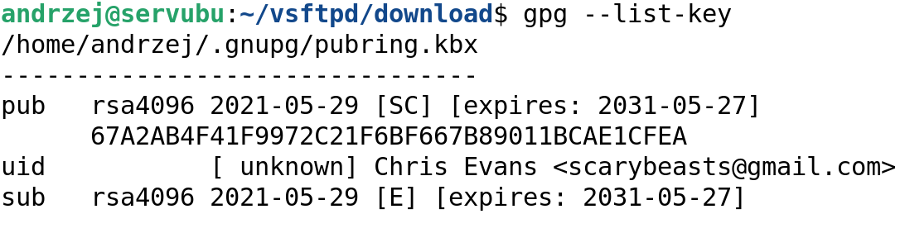

1. Sprawdź klucz komendą gpg --verify:

   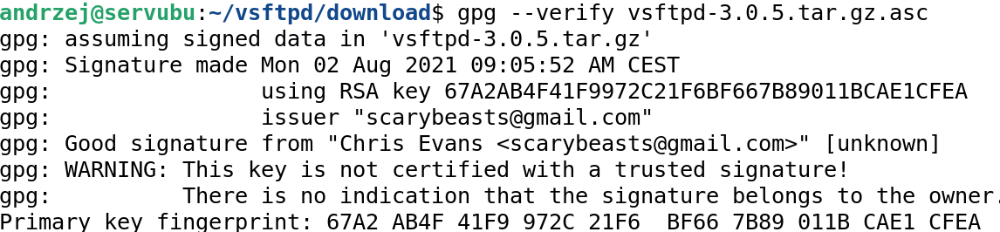

1. Sprawdzamy na stronie

   <https://security.appspot.com/vsftpd.html#download>

   odcisk palca.

   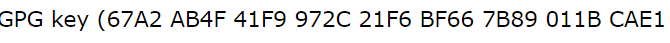

1. Rozpakować plik **vsftpd-3.0.5.tar.gz** komendą tar.

   

1. Następnie przejść do katalogu vsftpd-3.0.5

1. Przeczytaj zawartość pliku INSTALL.

1. Wydać komendę: **make**

1. Jeśli make zakończy się bez błędów, wydać komendę:

   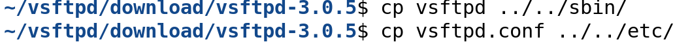

1. Przejdź do katalogu /home/twoje_konto/vsftpd i załóż katalogi sbin,
    etc i log.

1. Ustaw uprawnienia:

   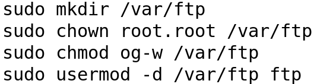

1. Sprawdź czy istnieje konto ftp ( można
    sudo apt install vsftpd)

   

   
1. Ustaw prawa:

1. Uruchom serwer komendą:

   

1. Zaloguj się na serwerze i załóż katalog /usr/share/empty

   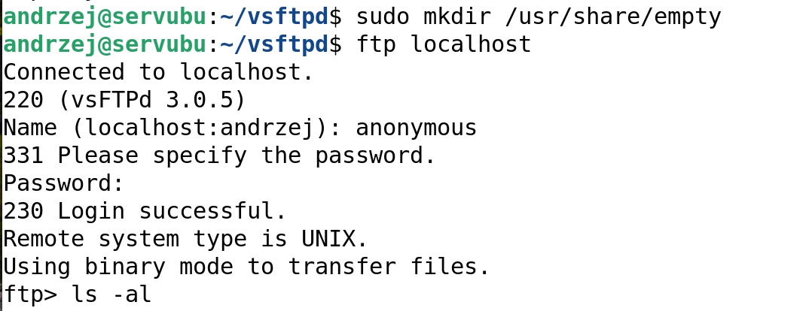

1. Sprawdź czy istnieje proces dla serwera komendą: ps aux \| grep
    vsftpd

   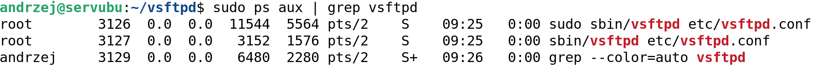

1. Utwórz plik:

   

1. Ściągnij plik

   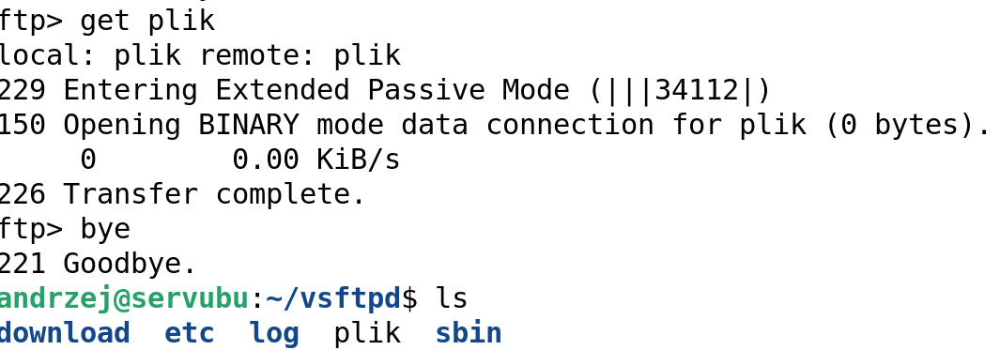

1. Sprawdź działanie serwera ftp, wyślij na serwer plik:

   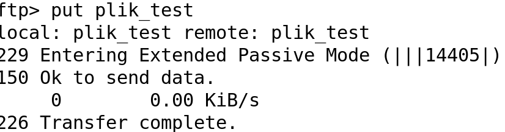

1. Sprawdź log, tail -f
    /var/log/vsftpd.log:

   

1. Ustaw banner ftp dla serwera na min. 30 znaków:

    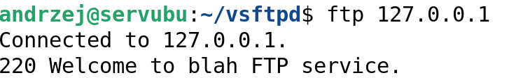

1. Sprawdź logi:

   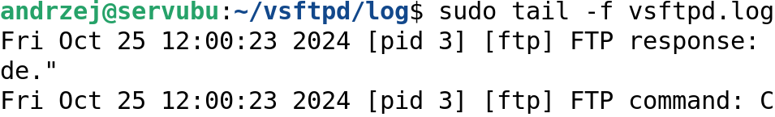

1. Przestaw logi na swoją lokalizację
    \~/vsftpd/log, utwórz dual log w oparciu o notatki z wykładu:

   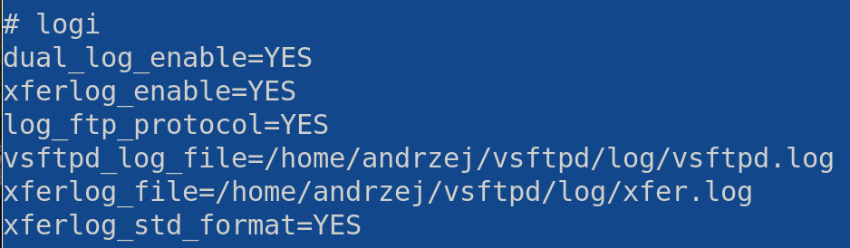

1. Sprawdź aktywne połączenia ze swoim serwerem komendą:

   ```bash
   netstat 
   lub 
   ss -anp | grep 21
   ```

   

1. Zezwól na logowanie się użytkowników systemowych, następnie wykonaj
    powyższe zadania dla swojego konta.

1. Stwórz konfigurację serwera dla obsługi SSL ( następna strona ).

1. Utwórz katalog ~/vsftpd_ssl/download

1. Skopiuj do niego plik vsftpd-3.0.5.tar.gz

   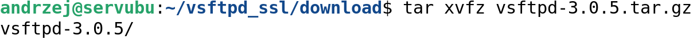

1. Rozpakuj plik jak wcześniej:

1. Edycja pliku:

   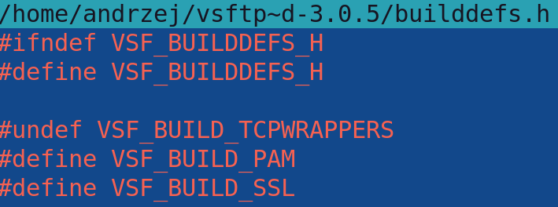

   

1. Zmodyfikuj plik Makefile tak, aby
    (dopisz Wno):

   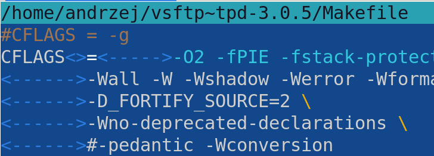

1. Wydaj komendę make.

1. Jeśli wystąpią błędy to zainstaluj
    pakiet libssl-dev.

   

1. Wydaj komendę make.

1. Wygeneruj certyfikat tak jak dla apache ( sudo openssl ....).

1. Reszta jak na wykładzie.

   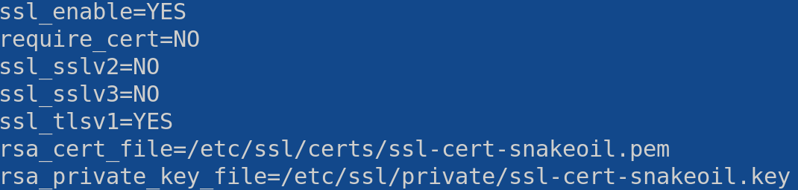

1. Przetestuj działanie serwera po ssl.

   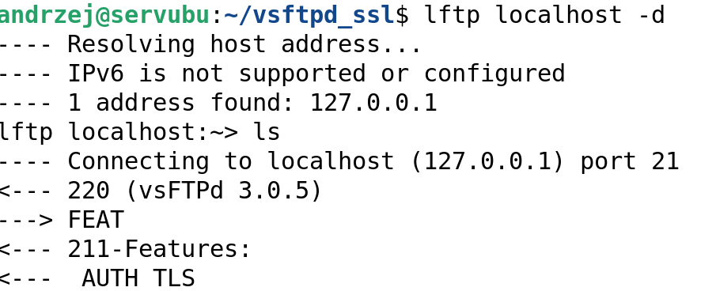

1. KONIEC. 🔚
