Ćwiczenia 9 -- Ubuntu serwer -- prawa do plików
Zaloguj się na swoje konto imienXYZ, gdzie XYZ oznacza kod klasy i
grupy, np. jank3t1
1.  Dodaj swoje konto do grupy sudo: *sudo usermod twoje_konto -G sudo*
2.  Sprawdzenie czy jesteśmy w grupie sudo: *id konto*
3.  sudo systemctl status atd, sudo systemctl restart atd
4.  Wyświetl listę wszystkich usług: sudo systemctl \--no-pager \| less
5.  mkdir prawaXYZ, za XYZ podaj kod klasy I grupy
6.  cd prawaXYZ
7.  umask
8.  mkdir katalog1, katalog2, touch plik1, plik2
9.  ls -al lub ll
10. chmod 211 plik1
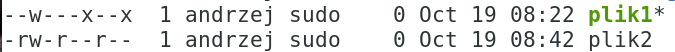
11. Nadaj uprawnienia:
rw-r-xr\-- dla plik1,
> rwx-w\-\--x dla plik2,
>
> r-x\--x\--x dla katalog1,
>
> rw\--wxr\-- dla katalog2.
>
> 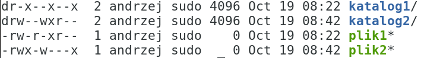
12. cd katalog2 i chmod 734 katalog2
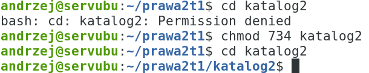
13. mkdir dane, touch plik3, plik4
14. chmod 744 plik3
15. Sprawdzenie bitu t w systemie:

16. Sprawdzenie bitu s w systemie:
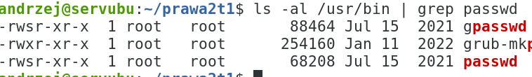
17. Ustawienie bitu s dla właściciela: chmod 4744 plik3 (małe s, tło
    pliku czerwone)
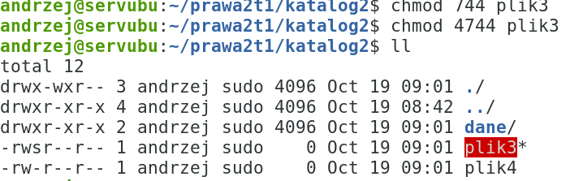
18. Ustawienie bitu s dla właściciela: chmod 4644 plik4 (dużo s, tło
    pliku czerwone)
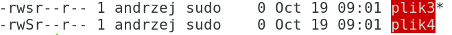
19. chmod 654 plik4
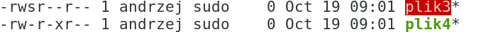
20. i chmod 2654 plik4 (małe s, tło pliku żółte)
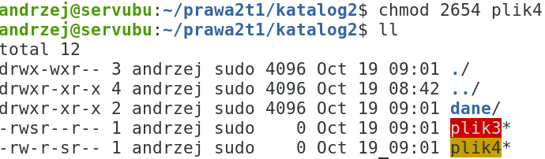
21. chmod 2744 plik3 (duże s, tło pliku żółte)
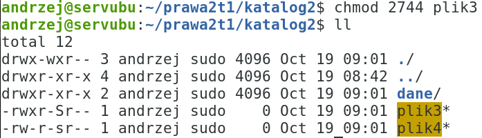
22. chmod 6744 plik3 (małe s(właściciel),duże S(grupa), tło pliku
    czerwone)
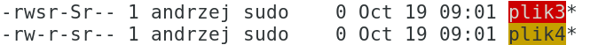
23. cp plik3 plik4 dane
24. cd dane
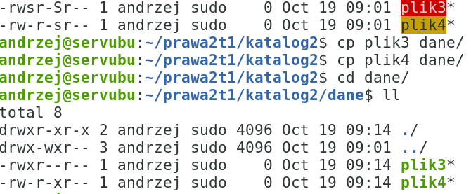
25. chmod 745 plik3
26. chmod 1745 plik3 (małe t),
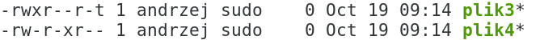
27. chmod 1654 plik4 (duże T)
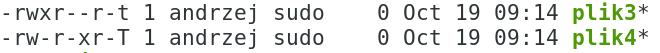
28. chmod 7654 plik4 (duże s(właściciel),małe s(grupa),duże T,tło
    czerwone)
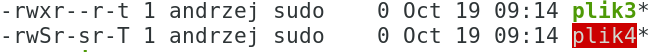
29. ls -alR \~/prawaXYZ ( \~ oznacza katalog domowy)
30. tree -pC \~/prawaXYZ\~
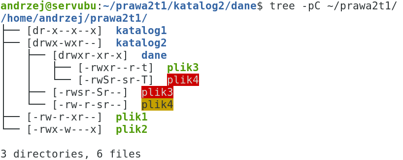
31. cd katalog1
32. mkdir doc1,doc2, touch plik5, plik6
    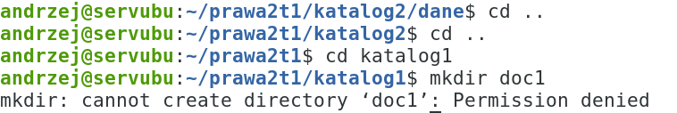
33. Dodać uprawnienie w dla właściciela dla katalog1)
34.
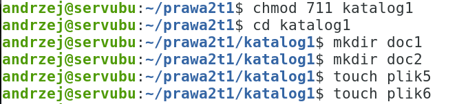
35. chmod u-x,g+w,o-r doc1
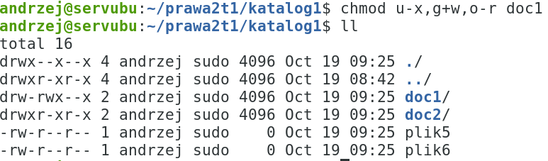
36. chmod -R 422 \~/prawaXYZ/katalog2
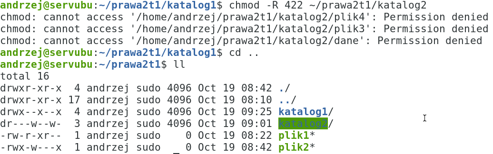
37. Z sudo
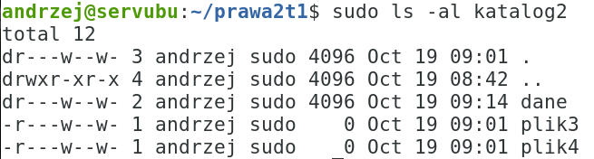
38. Wyszukanie wszystkich plików w katalogu /usr/bin z bitem s dla
    właściciela:
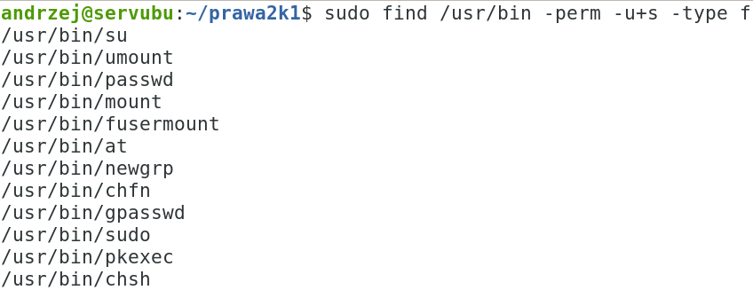
39. *sudo shutdown now* ( na koniec zajęć)
