# Ćwiczenia 9 -- Ubuntu serwer -- prawa do plików

Zaloguj się na swoje konto imienXYZ, gdzie XYZ oznacza kod klasy i
grupy, np. jank3t1

1. Dodaj swoje konto do grupy sudo:

   ```bash
   sudo usermod twoje_konto -G sudo
   ```

1. Sprawdzenie czy jesteśmy w grupie sudo:

   ```bash
   id konto
   ```

1. Status i restart usługi atd:

   ```bash
   sudo systemctl status atd
   sudo systemctl restart atd
   ```

1. Wyświetl listę wszystkich usług:

   ```bash
   sudo systemctl --no-pager | less
   ```

1. Stwórz katalog: `mkdir prawaXYZ`, za XYZ podaj kod klasy I grupy

1. Przejdź do założonego katalogu: `cd prawaXYZ`

1. Sprawdź ustawienia dla nowo tworzonych plików i katalogów:

   ```bash
   umask
   ```

1. mkdir katalog1, katalog2, touch plik1, plik2

1. ls -al lub ll

1. chmod 211 plik1

   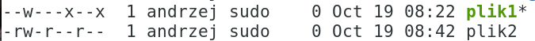

1. Nadaj uprawnienia:

   rw-r-xr\-- dla plik1,

   rwx-w\-\--x dla plik2,

   r-x\--x\--x dla katalog1,

   rw\--wxr\-- dla katalog2.

   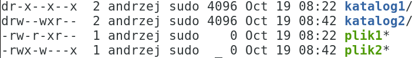

1. Polecenia:

   ```bash
   cd katalog2
   chmod 734 katalog2
   ```

   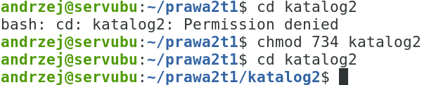

1. mkdir dane, touch plik3, plik4

1. Polecenie:

   ```bash
   chmod 744 plik3
   ```

1. Sprawdzenie bitu t w systemie:

   

1. Sprawdzenie bitu s w systemie:

   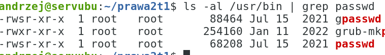

1. Ustawienie bitu s dla właściciela: chmod 4744 plik3 (małe s, tło
    pliku czerwone)

   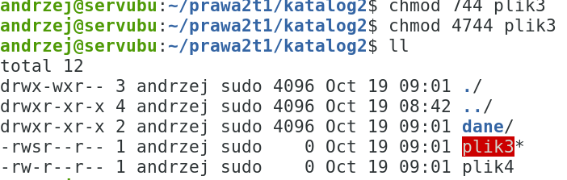

1. Ustawienie bitu s dla właściciela: chmod 4644 plik4 (dużo s, tło
    pliku czerwone)

   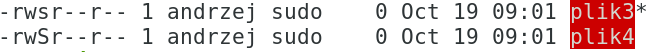

1. Polecenie:

   ```bash
   chmod 654 plik4
   ```

   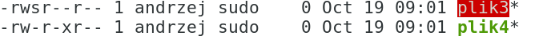

1. Polecenie:

   ```bash
   chmod 2654 plik4 (małe s, tło pliku żółte)
   ```

   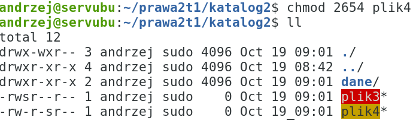

1. chmod 2744 plik3 (duże s, tło pliku żółte)

   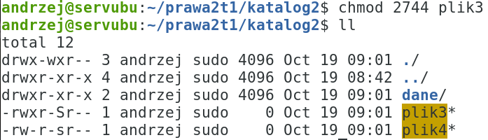

1. chmod 6744 plik3 (małe s(właściciel),duże S(grupa), tło pliku
    czerwone)

   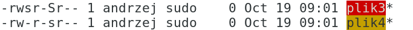

1. cp plik3 plik4 dane

1. cd dane

   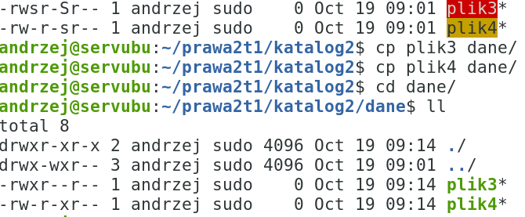

1. chmod 745 plik3

1. chmod 1745 plik3 (małe t),

   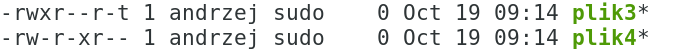

1. chmod 1654 plik4 (duże T)

   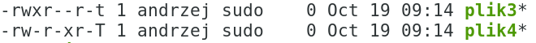

1. chmod 7654 plik4 (duże s(właściciel),małe s(grupa),duże T,tło
    czerwone)

   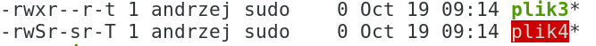

1. ls -alR ~/prawaXYZ ( \~ oznacza katalog domowy)

1. Polecenie:

   ```bash
   tree -pC ~/prawaXYZ\~
   ```

   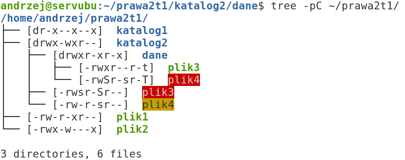

1. cd katalog1

1. mkdir doc1,doc2, touch plik5, plik6

   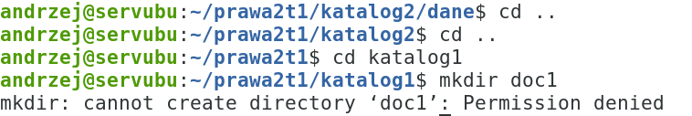

1. Dodać uprawnienie w dla właściciela dla katalog1)

   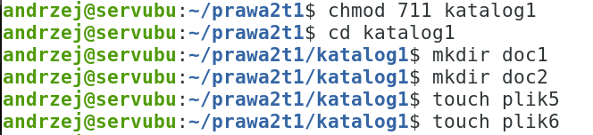

1. Polecenie:

   ```bash
   chmod u-x,g+w,o-r doc1
   ```

   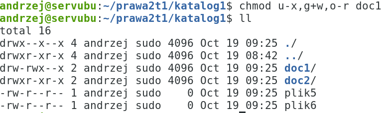

1. Polecenie:

   ```bash
   chmod -R 422 ~/prawaXYZ/katalog2
   ```

   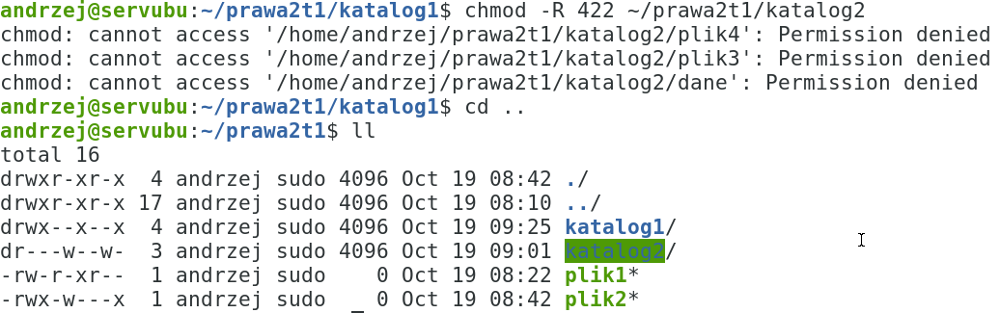

1. Z sudo

   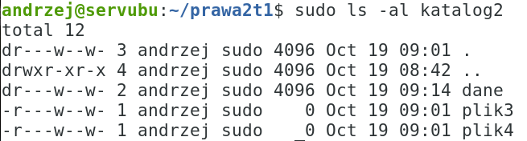

1. Wyszukanie wszystkich plików w katalogu /usr/bin z bitem s dla
    właściciela:

   

1. Na koniec zajęć polecenie:

   ```bash
   sudo shutdown now
   lub 
   poweroff
   ```
